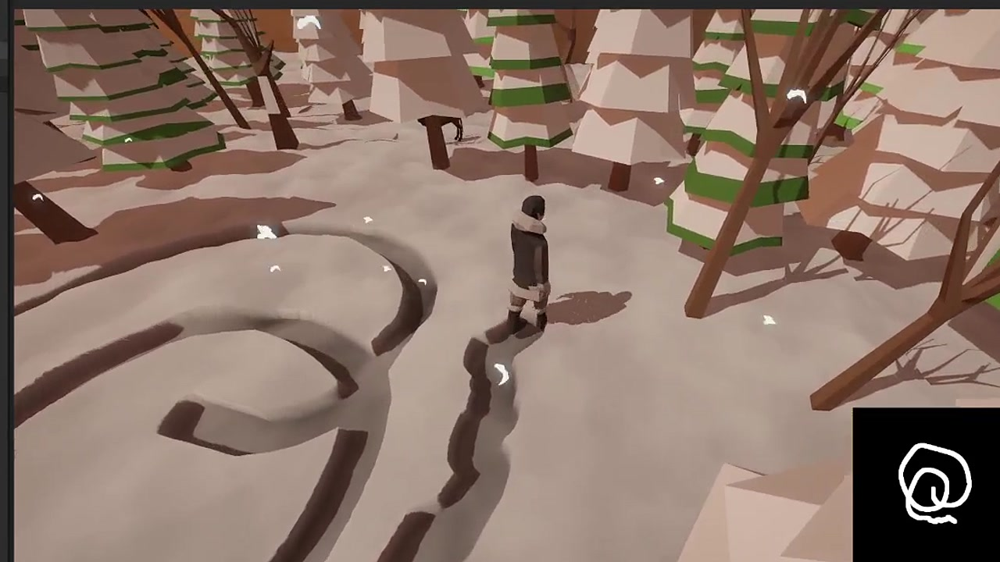

# Interactive Snow — Unity URP

A compact Unity portfolio project that turns character movement into persistent snow deformation at runtime



[Watch the 15-second demonstration](Documentation/Videos/interactive-snow-demo.mp4)

## Overview

The project records a moving character as a continuous mask in a runtime Render Texture, then uses that mask in Shader Graph to control snow displacement, color, and normal detail

The final implementation uses code-driven texture painting rather than a tracking camera as its authoritative path. A legacy camera and VFX Graph experiment remains in the project for comparison

## Technical highlights

### 1. World position to snow UV

`PlayerControl` casts a ray against the snow `MeshCollider`, reads `RaycastHit.textureCoord`, converts the UV into pixel coordinates, and stamps a soft brush into the runtime Render Texture


### 2. Continuous track interpolation

Movement between frames is subdivided by `trackInterpolation`. The additional samples prevent visible gaps when the character moves quickly or the frame rate changes


### 3. Shader-driven deformation

The Shader Graph samples `_TrackTexture` in both vertex and fragment stages. The mask drives vertex displacement while related branches adjust surface color and reconstructed normal detail


### 4. Runtime-friendly ownership

- A runtime ARGB32 Render Texture stores persistent track data
- `MaterialPropertyBlock` assigns the texture per snow renderer without cloning the material
- A configurable stamp limit prevents large teleports from producing unbounded work in one frame
- An optional `RawImage` exposes the live mask for debugging and portfolio presentation
- Camera-relative movement and an orbit camera provide a standard third-person presentation

## Data flow

```text
Character movement
        ↓
World-space interpolation
        ↓
MeshCollider raycast
        ↓
Surface UV → Render Texture pixel
        ↓
Soft brush stamp
        ↓
Shader Graph vertex displacement + shading
```

## Project structure

```text
Assets/
├─ Scripts/PlayerController.cs       Runtime movement, orbit camera, UV painting
├─ Shader/SG_Snow.shadergraph        Final snow deformation and shading graph
├─ Materials/Mat_Snow.mat            Final Shader Graph material
├─ Resources/                        Dense snow meshes, brush, and RT assets
├─ InteractiveSnow/                  Earlier tracking-camera experiment
└─ Scenes/
   ├─ Code.unity                     Final portfolio scene
   └─ TestScene.unity                Compact reference scene
Documentation/
├─ Images/                            README captures
└─ Videos/interactive-snow-demo.mp4  Edited 15-second demonstration
```

## Requirements

- Unity `2022.3.62f2`
- Universal Render Pipeline `14.0.12`
- Shader Graph
- Visual Effect Graph for the legacy comparison scene

## Opening the project

1. Clone the repository
2. Open the folder with Unity `2022.3.62f2`
3. Let Unity restore packages from `Packages/manifest.json`
4. Open `Assets/Scenes/TestScene.unity` for the compact reference setup
5. Open `Assets/Scenes/Code.unity` for the final portfolio composition after restoring its external presentation assets

The public repository intentionally excludes redistributable copies of third-party character, creature, vegetation, and skybox packages. The final `Code` scene may show missing prefab references until equivalent licensed assets are imported. The interaction code, snow meshes, Shader Graph, materials, project settings, screenshots, and demonstration remain available for review

See [THIRD_PARTY_NOTICES.md](THIRD_PARTY_NOTICES.md) for details

## Controls

- `WASD` — move relative to the camera
- `Left Shift` — run
- Hold `Right Mouse Button` — orbit the camera
- `Mouse Wheel` — zoom

## Reference and attribution

The project was developed while studying the Bilibili tutorial [Unity 可交互雪地视频教程（包含代码计算轨迹图方式）](https://www.bilibili.com/video/BV1MT4y1a7ut?p=11&vd_source=df4a61d6ea26dbda80b1572d707073cb)

The portfolio implementation extends the tutorial concepts with runtime UV painting, movement interpolation safeguards, Render Texture preview, character animation integration, and an orbiting third-person controller

---

# 交互式雪地 — Unity URP

这是一个 Unity 作品集项目，将角色移动实时记录为持续存在的雪地凹陷轨迹


[观看 15 秒演示视频](Documentation/Videos/interactive-snow-demo.mp4)

## 项目概述

项目把角色移动轨迹绘制到运行时 Render Texture，再由 Shader Graph 读取这张遮罩，驱动雪地的顶点位移、颜色变化和法线细节

最终版本以代码绘制轨迹图作为主要实现，同时保留早期的 Track Camera 与 VFX Graph 实验方案用于对比

## 核心技术点

### 1. 世界坐标转换为雪地 UV

`PlayerControl` 向雪地 `MeshCollider` 发射射线，通过 `RaycastHit.textureCoord` 获取表面 UV，将其换算成 Render Texture 像素坐标，并绘制柔边笔刷


### 2. 连续轨迹插值

脚本根据 `trackInterpolation` 对相邻两帧的位置进行补点，避免角色移动速度较快或帧率变化时出现断裂轨迹


### 3. Shader Graph 雪地变形

Shader Graph 在顶点和片元阶段读取 `_TrackTexture`，通过遮罩控制顶点位移，并同步调整颜色与重建后的法线细节


### 4. 运行时设计

- 使用运行时 ARGB32 Render Texture 保存持久轨迹
- 通过 `MaterialPropertyBlock` 为雪地 Renderer 设置贴图，避免复制材质
- 使用单帧最大盖章数量限制，避免角色瞬移带来无上限开销
- 使用可选 `RawImage` 实时展示轨迹遮罩，方便调试和作品集演示
- 提供基于相机方向的移动和自由环绕第三人称相机

## 数据流程

```text
角色移动
   ↓
世界空间位置插值
   ↓
MeshCollider 射线检测
   ↓
表面 UV → Render Texture 像素
   ↓
绘制柔边笔刷
   ↓
Shader Graph 顶点位移与表面着色
```

## 工程结构

```text
Assets/
├─ Scripts/PlayerController.cs       移动、环绕相机与 UV 绘制
├─ Shader/SG_Snow.shadergraph        最终雪地变形和着色
├─ Materials/Mat_Snow.mat            Shader Graph 材质
├─ Resources/                        雪地网格、笔刷和 RT 资源
├─ InteractiveSnow/                  早期 Track Camera 实验方案
└─ Scenes/
   ├─ Code.unity                     最终作品集场景
   └─ TestScene.unity                精简参考场景
Documentation/
├─ Images/                            README 截图
└─ Videos/interactive-snow-demo.mp4  剪辑后的 15 秒演示
```

## 环境要求

- Unity `2022.3.62f2`
- Universal Render Pipeline `14.0.12`
- Shader Graph
- Visual Effect Graph，用于早期实验场景

## 打开工程

1. 克隆仓库
2. 使用 Unity `2022.3.62f2` 打开项目目录
3. 等待 Unity 根据 `Packages/manifest.json` 恢复依赖
4. 打开 `Assets/Scenes/TestScene.unity` 查看精简参考方案
5. 恢复外部展示资源后，打开 `Assets/Scenes/Code.unity` 查看最终作品集场景

公开仓库不会重新分发第三方角色、动物、植被和天空盒资源包，因此最终 `Code` 场景在重新导入相应授权资源前可能出现 Prefab 丢失。核心交互代码、雪地网格、Shader Graph、材质、项目设置、截图和演示视频均保留在仓库中供审阅

详细说明见 [THIRD_PARTY_NOTICES.md](THIRD_PARTY_NOTICES.md)

## 操作方式

- `WASD` — 按相机方向移动
- `左 Shift` — 奔跑
- 按住 `鼠标右键` — 环绕旋转相机
- `鼠标滚轮` — 缩放镜头

## 参考与致谢

本项目在学习 Bilibili 教程 [Unity 可交互雪地视频教程（包含代码计算轨迹图方式）](https://www.bilibili.com/video/BV1MT4y1a7ut?p=11&vd_source=df4a61d6ea26dbda80b1572d707073cb) 的过程中完成

作品集版本在教程思路上补充了运行时 UV 绘制、移动插值保护、Render Texture 实时预览、角色动画接入和自由环绕第三人称控制
