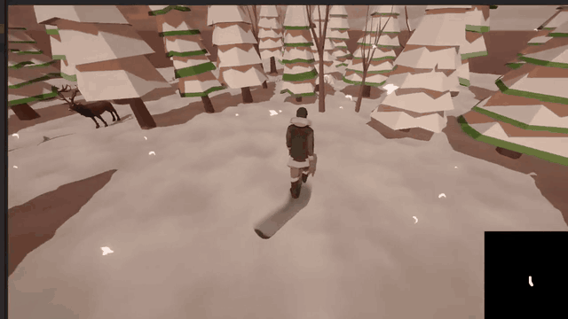
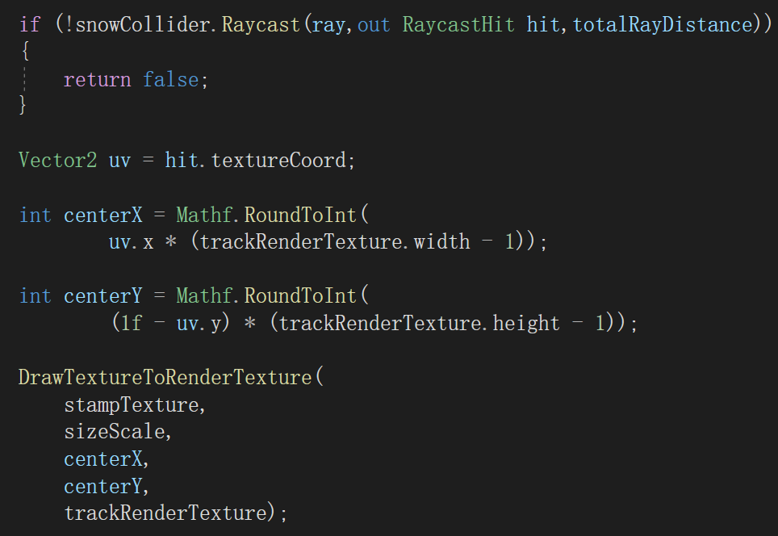
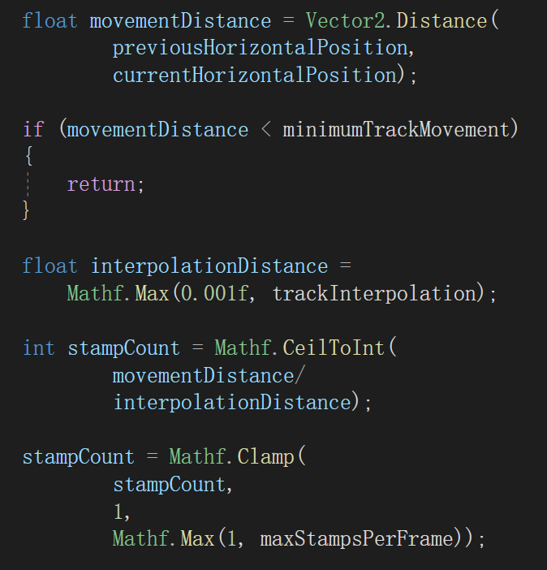
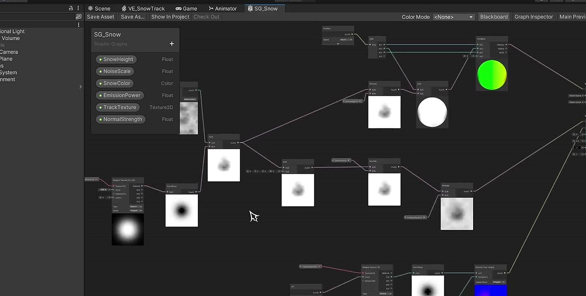

# Interactive Snow — Unity URP

Interactive snow deformation in Unity URP using Render Texture painting and Shader Graph.

[Full-resolution screenshot](Documentation/Images/interactive-snow-result.jpg) · [Watch the 15-second demonstration](Documentation/Videos/interactive-snow-demo.mp4)

Character movement paints a persistent track mask into a Render Texture. Shader Graph reads the mask to displace the snow surface and adjust its color and normals.

## Technical highlights

### 1. World position to snow UV

`PlayerControl` raycasts against the snow `MeshCollider`, reads `RaycastHit.textureCoord`, and draws a soft brush at the corresponding Render Texture pixel.

### 2. Continuous track interpolation

`trackInterpolation` sets the distance between brush samples along the movement path, keeping the track connected between frames.

### 3. Shader-driven deformation

Shader Graph samples `_TrackTexture` to control vertex displacement, surface color, and normal detail.

## Setup

Open the project with Unity `2022.3.62f2` and let Unity restore the packages. The project uses URP `14.0.12`, Shader Graph, and Visual Effect Graph.

- `Assets/Scenes/Code.unity` — final scene with code-painted tracks
- `Assets/Scenes/TestScene.unity` — earlier tracking-camera setup

Third-party character, animal, tree, and skybox source assets are not included. Restore the licensed assets or replace their references to reproduce the full `Code` scene shown in the demo.

## Controls

- `WASD` — move relative to the camera
- `Left Shift` — run
- Hold `Right Mouse Button` — orbit the camera
- `Mouse Wheel` — zoom

## Reference

Based on the tutorial [Unity 可交互雪地视频教程（包含代码计算轨迹图方式）](https://www.bilibili.com/video/BV1MT4y1a7ut?p=11).

---

# 交互式雪地 — Unity URP

使用 Render Texture 绘制和 Shader Graph 实现的 Unity URP 交互式雪地。

[查看高清截图](Documentation/Images/interactive-snow-result.jpg) · [观看 15 秒演示视频](Documentation/Videos/interactive-snow-demo.mp4)

角色移动时，代码将轨迹持续绘制到 Render Texture。Shader Graph 读取这张遮罩，驱动雪地顶点位移、颜色和法线变化。

## 核心技术点

### 1. 世界坐标转换为雪地 UV

`PlayerControl` 向雪地 `MeshCollider` 发射射线，通过 `RaycastHit.textureCoord` 获取表面 UV，在对应的 Render Texture 像素位置绘制柔边笔刷。

### 2. 连续轨迹插值

`trackInterpolation` 控制移动路径上相邻笔刷采样点的距离，通过补点让帧与帧之间的轨迹保持连续。

### 3. Shader Graph 雪地变形

Shader Graph 读取 `_TrackTexture`，通过遮罩控制顶点位移、表面颜色和法线细节。

## 运行

使用 Unity `2022.3.62f2` 打开工程并等待依赖恢复。项目使用 URP `14.0.12`、Shader Graph 和 Visual Effect Graph。

- `Assets/Scenes/Code.unity` — 代码绘制轨迹的最终场景
- `Assets/Scenes/TestScene.unity` — 早期 Track Camera 实验场景

仓库未包含第三方人物、动物、树木和天空盒的源资源。需要导入相应的授权资源或替换其引用，才能完整还原演示中的 `Code` 场景。

## 操作方式

- `WASD` — 按相机方向移动
- `左 Shift` — 奔跑
- 按住 `鼠标右键` — 环绕旋转相机
- `鼠标滚轮` — 缩放镜头

## 参考

参考教程：[Unity 可交互雪地视频教程（包含代码计算轨迹图方式）](https://www.bilibili.com/video/BV1MT4y1a7ut?p=11)。
